# 🎨 Mosaic - VIBECODING Platform

<div align="center">


**AI-Powered Visual Frontend Development Platform**

[](https://github.com/ooiai/mosaic/stargazers)
[](https://github.com/ooiai/mosaic/network/members)
[](https://github.com/ooiai/mosaic/issues)
[](https://github.com/ooiai/mosaic/blob/main/LICENSE)

[](https://reactjs.org/)
[](https://www.typescriptlang.org/)
[](https://vitejs.dev/)
[](https://tauri.app/)
[](https://www.rust-lang.org/)

[🚀 Get Started](#-quick-start) • [📖 Documentation](#-documentation) • [🎯 Roadmap](#-roadmap) • [🤝 Contributing](#-contributing)

</div>

## 🌟 What is Mosaic?

Mosaic is revolutionizing frontend development through **VIBECODING** - an AI-powered visual development platform that transforms natural language descriptions into production-ready React components. Say goodbye to complex coding and hello to intuitive UI creation.

### 💡 The Vision

> "Describe what you want to build, and watch it come to life instantly."

We're building the future where anyone can create sophisticated user interfaces through simple conversation, eliminating the technical barriers that prevent great ideas from becoming reality.

## 🎯 Three-Phase Journey

<div align="center">

| Phase | Focus | Status |
|-------|-------|--------|
| 🎨 **Phase 1: VIBECODING** | Conversational UI Generation | 🔄 **In Progress** |
| 🚀 **Phase 2: Requirements Engine** | Natural Language to Frontend | 📋 **Planned** |
| 🌟 **Phase 3: Full-Stack Generation** | Complete App Development | 🔮 **Future** |

</div>

### Phase 1: VIBECODING Platform
Transform your ideas into React components through natural conversation:

```
👤 "Create a modern button with hover effects and loading states"
🤖 Generating optimized React component...
✅ Button component ready with TypeScript, animations, and accessibility features!
```

**Current Features:**
- 💬 Conversational component generation
- 🎨 Real-time visual preview
- 🔧 Targeted component modifications
- 🧩 Reusable component library
- ⚡ Instant code generation

### Phase 2: Requirements to Frontend (Coming Soon)
```
👤 "Build a dashboard for project management with charts and user authentication"
🤖 Analyzing requirements... Creating project structure... Generating components...
✅ Complete frontend application ready!
```

### Phase 3: Full-Stack Generation (Future)
```
👤 "Create a social media platform with real-time messaging"
🤖 Generating frontend... Creating backend APIs... Setting up database... Configuring deployment...
✅ Production-ready full-stack application deployed!
```

## 🏗️ Architecture Excellence

```mermaid
graph TB
    A[🌐 Web App] --> C[💬 VIBECODING Engine]
    B[🖥️ Desktop App] --> C
    C --> D[🤖 AI Processing]
    C --> E[⚛️ React Generator]
    C --> F[🧩 Component Library]
    D --> G[📝 Code Output]
    E --> G
    F --> G
```

<div align="center">



</div>

**Universal Frontend Architecture:**
- 🌍 **Single Codebase**: React app runs everywhere
- 🖥️ **Desktop Enhanced**: Tauri provides native capabilities
- ⚡ **Lightning Fast**: Vite + Rolldown for optimal performance
- 🔒 **Secure**: Rust backend ensures safety and speed

## 🚀 Quick Start

### One Command Setup
```bash
# Clone and run
git clone git@github.com:ooiai/mosaic.git
cd mosaic && pnpm install

# Start VIBECODING platform
cd apps/web && pnpm dev      # Web version at localhost:5173
# OR
cd apps/desktop && pnpm dev  # Desktop version with native features
```

### Development Ready in 30 seconds
1. **Prerequisites**: Node.js 18+, pnpm, Rust (for desktop)
2. **Install**: `pnpm install`
3. **Develop**: Choose your platform and start coding with AI!

## 🎨 VIBECODING in Action

### Natural Language → Production Code

<div align="center">

| Input | Output |
|-------|--------|
| "Modern card with shadow and hover effect" | `<Card className="shadow-lg hover:shadow-xl transition-shadow"/>` |
| "Responsive navigation with mobile menu" | Complete navbar component with breakpoints |
| "Data table with sorting and pagination" | Full-featured table with TypeScript interfaces |

</div>

### Key Benefits

🎯 **10x Faster Development** - Generate components in seconds, not hours
🧠 **AI-Powered Intelligence** - Context-aware code generation
🎨 **Design System Compliant** - Consistent, professional components
♿ **Accessibility First** - WCAG compliant by default
📱 **Responsive Ready** - Mobile-first responsive components

## 📊 Project Stats

<div align="center">


</div>

## 🛠️ Technology Stack

### Frontend Powerhouse
- ⚛️ **React 19** - Latest features and performance
- 🏎️ **Vite + Rolldown** - Next-gen build tooling
- 📘 **TypeScript** - Type-safe development
- 🎨 **Modern CSS** - Advanced styling capabilities

### Desktop Excellence  
- 🦀 **Rust + Tauri v2** - Native performance, web flexibility
- 🔒 **Secure IPC** - Safe communication between layers
- 📁 **File System Access** - Local project management
- 🚀 **Cross-Platform** - Windows, macOS, Linux support

## 🌍 Community & Ecosystem

<div align="center">

[](https://discord.gg/YOUR_INVITE)
[](https://twitter.com/ooiai)

**Join our growing community of developers revolutionizing frontend development!**

</div>

## 🤝 Contributing

We welcome contributions from developers of all skill levels!

### How to Contribute
1. 🍴 **Fork** the repository
2. 🌟 **Create** a feature branch
3. 💻 **Code** your improvements
4. ✅ **Test** thoroughly
5. 📝 **Document** your changes
6. 🚀 **Submit** a pull request

### Areas We Need Help
- 🤖 AI model integration and optimization
- 🎨 UI/UX improvements for VIBECODING interface
- 📚 Documentation and tutorials
- 🐛 Bug fixes and performance improvements
- 🌍 Internationalization and accessibility

## 📈 Roadmap & Milestones

### 2024 Q1 - Q2: VIBECODING Foundation
- [x] Basic conversational UI generation
- [x] Component modification capabilities
- [x] Desktop application with Tauri
- [ ] Advanced component library
- [ ] Visual code editor interface
- [ ] Template system

### 2024 Q3 - Q4: Requirements Engine
- [ ] Natural language requirement parsing
- [ ] Multi-component application generation  
- [ ] Project architecture automation
- [ ] Integration with design tools

### 2025: Full-Stack Vision
- [ ] Backend API generation
- [ ] Database schema creation
- [ ] Deployment automation
- [ ] Team collaboration features

## 🏆 Why Choose Mosaic?

<div align="center">

| Traditional Development | Mosaic VIBECODING |
|------------------------|-------------------|
| Hours of coding | Seconds of conversation |
| Complex setup | One command start |
| Manual testing | AI-validated code |
| Accessibility afterthought | Built-in by default |
| Framework lock-in | Universal compatibility |

</div>

## 📞 Get in Touch

- 🐛 **Bug Reports**: [GitHub Issues](https://github.com/ooiai/mosaic/issues)
- 💡 **Feature Requests**: [Discussions](https://github.com/ooiai/mosaic/discussions)
- 📧 **Email**: hello@ooiai.com
- 🐦 **Twitter**: [@ooiai](https://twitter.com/ooiai)

## 📄 License

This project is licensed under the MIT License - see the [LICENSE](LICENSE) file for details.

---

<div align="center">

**🎨 Revolutionizing Frontend Development with AI**

Made with ❤️ by the [OOIAI Team](https://github.com/ooiai)

[](https://star-history.com/#ooiai/mosaic&Date)

*Star us on GitHub if you believe in the future of conversational development!*

</div>
