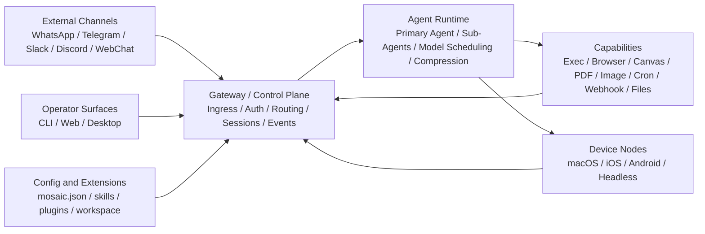

# Mosaic

<p align="center">
  <strong>A self-hosted AI assistant control plane.</strong>
</p>

<p align="center">
  Long-running, multi-channel, stateful, routable, executable, extensible, and governable.
</p>

<p align="center">
  
  
  
  
</p>

---

## Table of Contents

- [What Mosaic Is](#what-mosaic-is)
- [What Mosaic Is Not](#what-mosaic-is-not)
- [Architecture at a Glance](#architecture-at-a-glance)
- [Repository Layout](#repository-layout)
- [Quick Start](#quick-start)
- [Current Operator Surface](#current-operator-surface)
- [Engineering Rules](#engineering-rules)
- [Contributing](#contributing)

## What Mosaic Is

Mosaic is not designed as a single chat frontend. It is a self-hosted control plane for always-on AI agents that can:

- accept input from external channels such as WhatsApp, Telegram, Slack, Discord, and WebChat
- coordinate sessions, routing, permissions, memory, and event streams through a central Gateway
- orchestrate primary agents, sub-agents, model scheduling, and context compression
- expose operator surfaces such as terminal, web, and desktop control interfaces
- execute tools and device-node actions across browser, exec, canvas, pdf, image, cron, webhook, and file capabilities

In short: Mosaic is closer to an Agent OS than to a chatbot app.

## What Mosaic Is Not

Mosaic should not be treated as:

- a thin "chat UI + LLM API" wrapper
- a single-request/single-response assistant
- a product whose architecture is centered on one channel or one model
- a place where business orchestration is hidden inside adapters or generic infrastructure

## Architecture at a Glance



### Core Layers

| Layer                       | Responsibility                                                   | Meaning                                      |
| --------------------------- | ---------------------------------------------------------------- | -------------------------------------------- |
| Interaction Entry           | Normalize channel payloads and preserve context                  | Put the assistant where users already are    |
| Control Plane               | Ingress, auth, session mapping, routing, event broadcast         | The Gateway is the system hub                |
| Agent Runtime               | Agent orchestration, model strategy, compression, planning       | Runtime behavior is more than one model call |
| Capability Execution        | Run tools with permission boundaries and side-effect control     | Capabilities define both power and risk      |
| Device Node                 | Expose device-local actions through reconnectable node protocols | Extend agents into real devices              |
| Configuration and Extension | Control policies, plugins, skills, workspaces, hot reload        | Enable long-term product evolution           |

<details>
<summary><strong>Architecture principles</strong></summary>

- Channels are entrypoints, not the center of the system.
- The Gateway coordinates; it should not become a dumping ground.
- The runtime owns orchestration and collaboration, not just prompt execution.
- Tools and device nodes must preserve explicit permission boundaries.
- Configuration should describe behavior, not replace architecture.

</details>

## Repository Layout

Mosaic is organized as a Cargo workspace.

```text
mosaic/
|-- Cargo.toml
|-- Makefile
|-- README.md
|-- cli/
|   |-- Cargo.toml
|   `-- src/main.rs
`-- crates/
    `-- tui/
        |-- Cargo.toml
        `-- src/
```

### Workspace Rules

| Path           | Role                  | Rule                                                |
| -------------- | --------------------- | --------------------------------------------------- |
| `cli/`         | Composition root      | Start first-pass feature work here                  |
| `crates/`      | Reusable module layer | Move logic here once it is clearly shared or stable |
| workspace root | Consistency boundary  | Own shared dependencies, linting, and build policy  |

## Quick Start

Use the root `Makefile` as the standard entrypoint for local CLI workflows.

```bash
make build
make check
cargo run -p mosaic-cli
```

### Standard Commands

| Command        | Purpose                            |
| -------------- | ---------------------------------- |
| `make install` | Install the CLI binary from `cli/` |
| `make build`   | Build the CLI crate                |
| `make clean`   | Clean workspace build artifacts    |
| `make check`   | Run workspace checks               |

The installed binary name is `mosaic`.

## Current Operator Surface

The repository currently includes the first terminal control-plane slice.

<details open>
<summary><strong>TUI capabilities</strong></summary>

- left session list
- center task and conversation timeline
- top status bar with workspace, session, model, runtime, and gateway state
- bottom composer for operator instructions
- right observability panel for logs and activity
- keyboard-first navigation
- local mock control commands for stage-2 interaction flows

</details>

<details>
<summary><strong>Keyboard model</strong></summary>

| Key                     | Action                       |
| ----------------------- | ---------------------------- |
| `Tab` / `Shift+Tab`     | Cycle focus between panes    |
| `j` / `k` or arrow keys | Move within the focused pane |
| `i`                     | Jump to composer             |
| `Enter`                 | Submit composer input        |
| `Ctrl+L`                | Toggle observability panel   |
| `Esc`                   | Return focus to sessions     |
| `q` / `Ctrl+C`          | Quit                         |

</details>

<details>
<summary><strong>Local mock commands</strong></summary>

| Command                 | Effect                                        |
| ----------------------- | --------------------------------------------- | ---------- | --------------------------------- |
| `/help`                 | Show local control commands in the timeline   |
| `/logs`                 | Toggle the observability panel                |
| `/gateway connect`      | Mark gateway as connected in the local TUI    |
| `/gateway disconnect`   | Mark gateway as disconnected in the local TUI |
| `/runtime <status>`     | Update the runtime status label               |
| `/session state <active | waiting                                       | degraded>` | Update the selected session state |
| `/session model <name>` | Update the selected session model             |

</details>

## Engineering Rules

The repository is guided by a few non-negotiable boundaries:

- treat Mosaic as a control plane, not a chat app
- start new one-step feature work in `cli/`
- extract shared, stable logic into `crates/`
- keep Gateway semantics inside Mosaic crates, not generic infrastructure
- preserve compatibility unless a change is intentionally breaking
- keep authorization, auditability, observability, and interruption paths explicit

## Contributing

Before modifying the repository:

- read [`AGENTS.md`](./AGENTS.md) for architecture boundaries and repository rules
- read [`Constraints.md`](./Constraints.md) for the minimal-change constraint
- prefer the smallest safe change that preserves existing behavior

If repeated logic appears, extract one semantic implementation instead of creating multiple near-duplicates.
